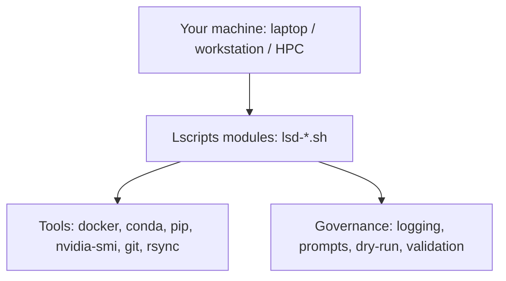

Lscripts is a **shell-first** automation framework. Instead of building a giant monolith, it gives you a **catalog of small,
auditable commands** that compose well:

- `lsd-docker.*` for container workflows
- `lsd-cuda.*` for NVIDIA/CUDA discovery & validation
- `lsd-python.*` for Conda governance and offline bundles
- `lsd-docs.*` to generate/update documentation

{: .prompt-info }
**Shell-first** doesn’t mean “old-school.” It means: *fast feedback*, *strong conventions*, and *visibility* into what happens.

## The mental model

Think in 3 layers:



### Naming conventions

- **Module prefixes**: `lsd-docker`, `lsd-cuda`, `lsd-python`, …
- **Verb phrases**: `*.install`, `*.verify`, `*.list`, `*.cfg`, `*.status`
- **Safety gates**: destructive actions prompt first (and default to **No**)

## Repo layout

In `lscripts-docker`, the important pieces are:

- `env.sh` → sets up paths and exports (meant to be `source`d)
- `install.sh` → optional installer wrapper
- `lscripts/` → the actual module library
- `docs/` → this documentation site (Chirpy theme)

## Quick start

From your repo root:

```bash
# 1) Load environment variables & functions for this shell session
source env.sh

# 2) (Optional) See configuration values (paths, docker, nvidia)
lsd-cfg.system
lsd-cfg.docker
lsd-cfg.nvidia

# 3) Print the full command catalog (or open /cmds/ on the docs site)
lsd-docs.cmds
```

{: .prompt-tip }
If you’re unsure what a command will do, prefer commands that support `--dry-run=true` or that clearly print a “plan” first.

## How to use this documentation

- Use the **2026 “Field Manual”** series as the canonical reading path.
- Use **Search** (`/`) to jump directly to a command.
- Use **Categories** to browse by subsystem (Docker / CUDA / Conda / Ops).

## Next

Continue with: **Install Guide (Workstation + HPC)**.
