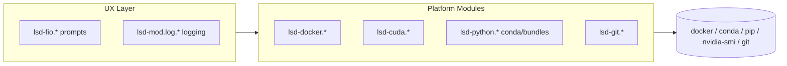

This chapter is the “why” behind the codebase.

## Core design principles

### 1) Read-only by default

If a function **can** be informational, it should be informational.
Mutation is allowed — but should be explicit.

### 2) No hidden state

- All plans should print paths and names before executing.
- Log files should be written deterministically under `logs/`.

### 3) Composable primitives

Most tasks are *pipelines of small commands*:

- detect environment
- validate assumptions
- execute
- validate result

### 4) Portable across environments

Lscripts aims to work across:

- developer laptop
- multi-user workstation
- HPC login nodes
- air-gapped compute nodes

## Module structure

At a high level:

## Logging as a first-class feature

Good automation produces artifacts:

- command output logs
- environment manifests
- checksums / integrity reports

This makes runs **auditable** and **replayable**.

## Environment conventions

You’ll see conventions like:

- `__CODEHUB_ROOT__` and `__DATAHUB_ROOT__`
- `logs/` for generated artifacts
- consistent naming of environments, bundles, and outputs

{: .prompt-tip }
Treat your docs site as an extension of the system: when you add a module, add a chapter (or at least a command entry).

## Next

Continue with: **Operations & validation**.
